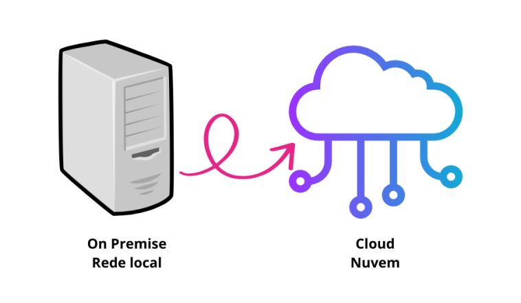

# Cloud AWS

Computação na nuvem é o termo que utilizamos para serviços e plataformas que estarão disponíveis fora da sua máquina local, podemos aqui ter desde sistema operacionais, servidores completos com recursos de memória Ram e Processadores tudo por conta de uma empresa que estará cuidando da parte física dessa operação. Lembrando que o tipo e tamanho do recurso serão escolhidos pelo contratante e o pagamento na maioria das vezes é conforme a demanda de utilização.

Para melhor aproveito do material, esta sendo implementado nesse momento um dicionário de termos, sinta-se a vontade em contribuir sua dúvida ou observação sobre o mesmo através da rede social: https://www.linkedin.com/in/hernandesjacque/ e/ou e-mail: ti.jacque@gmail.com ou pull request.

Temos aqui alguns serviços tais como: 

- computação
- redes e entregas de conteúdos
- gerenciamento e governança
- banco de dados
- segurança, identidade e compliance*
- gerenciamento de custos
- armazenamentos

## Infraestrutura global AWS

- **Região** é um conjunto de zona de disponibilidades onde teremos um conjunto de coleção de recursos em uma localização geográfica. Exemplo o norte da Virgínia é geralmente a região onde são implementados novos recursos em primeiro momento e depois esses recursos são replicados para outras regiões. Outro dado interessante é que no norte da Virgínia temos 6 zonas de disponibilidade.

  Dessa forma teremos os novos recursos implementados primeiro nas Regiões que surgiram primeiro, e por ultimo nas regiões mais atuais.

  Outro fato importante é saber que cada região é como se um Estado, que é empregado os servidores e cada uma das regiões vão ter sempre no mínimo 2 zonas de disponibilidade para garantir redundância entre os serviços/dados nesta alocados.

### zonas de disponibilidade e regiões (outubro de 2023)

| Localização                            | Quant. de zonas | Região         |
| -------------------------------------- | --------------- | -------------- |
| Africa (Cape Town)                     | 2               | af-south-1     |
| Hong Kong                              | 2               | ap-east-1      |
| Tóquio                                 | 2               | ap-northeast-1 |
| Asia Pacific (Seoul)                   | 2               | ap-northeast-2 |
| Asia Pacific (Osaka)                   | 2               | ap-northeast-3 |
| Mumbai                                 | 2               | ap-south-1     |
| Ásia-Pacífico (Haiderabade)            | 1               | ap-south-2     |
| Singapura                              | 2               | ap-southeast-1 |
| Sydney                                 | 2               | ap-southeast-2 |
| Ásia-Pacífico (Jacarta)                | 1               | ap-southeast-3 |
| Ásia-Pacífico (Melbourne)              | 1               | ap-southeast-4 |
| Canada (Central)                       | 4               | ca-central-1   |
| Europe (Frankfurt)                     | 2               | eu-central-1   |
| Europa (Zurique)                       | 1               | eu-central-2   |
| Estolcomo                              | 2               | eu-north-1     |
| Europa (Espanha)                       | 1               | eu-south-2     |
| Irlanda                                | 2               | eu-west-1      |
| Londres                                | 2               | eu-west-2      |
| Paris                                  | 2               | eu-west-3      |
| Oriente Médio (Emirados Árabes Unidos) | 1               | me-central-1   |
| Oriente Médio (Bahrein)                | 2               | me-south-1     |
| **São Paulo**                          | 2               | sa-east-1      |
| Norte da Virgínia                      | 6               | us-east-1      |
| Ohio                                   | 3               | us-east-2      |
| AWS GovCloud (Leste dos EUA)           | 1               | us-gov-east-1  |
| AWS GovCloud (Oeste dos EUA)           | 1               | us-gov-west-1  |
| Norte Califórnia                       | 3               | us-west-1      |
| Oregon                                 | 4               | us-west-2      |

- **Zona de disponibilidade estão distintos a quilômetros de distância uma das outras**, conectadas com alta velocidade, com segurança local, refrigeração e poder ser um ou mais data centers. Distância entre as zonas de até 100km. Estes são conectados para ter baixa latência, auto rendimento e redundância. Essa disposição das zonas está relacionado ao conceito e Escalabilidade.

Ao contratar um serviço AWs a ideia será sempre ver qual a região mais próximo do seu usuário. Não importando muito qual a zona de disponibilidade exatamente esta seu serviço, o foco é a região estar o mais próximo possível. Dependendo de como é configurado a sua instancia quando uma zona estiver com problemas ou indisponível a outra irá assumir o serviço. Esse modelo garantiu a AWS o título de **líder do IaaS - infraestrutura como serviço**.

- **Edge Locations** ou **PoPs (pontos de presença) ou zonas locais - são utilizados como cache de dados** é uma infraestrutura de servidores, localizado próximo de uma zona de disponibilidade, armazena dados mais solicitados no cache para melhorar latência de uma requisição de consulta. Estão em pontos estratégicos sem cobertura pela AWS. Exemplo:  **Amazon Cloud Front**, que armazena o cache do seu site estático, por exemplo. Outro serviço **AWS Lightsail** ou **AWS ElastiCache** (banco de dados em memória)

## Seis vantagens do uso da AWS

1. **Save Money** - não gastar com manutenção de hardware
2. **Stop Guessing** - ter maior precisão de valores com investimento em tecnologias, não é necessário planejar infraestrutura que ficará obsoleta daqui algum tempo, você pode contratar um serviço menor e ir escalando conforme a demanda e acompanhamento de consumo.
3. **Variable Expenses** - você paga pelo que é utilizado e diminui a posse, é o aluguel do recurso na nuvem. Troca de despesa capital por despesa variável.
4. **Economies of Scale** - quanto mais empresas contratam um serviço na AWS mais esse recurso ficará com valor mais acessível pois a AWS "repassa" essa escala de maneira a melhorar o valor cobrado.
5. **Increase Speed and Agility** - enquanto em um rede local você demora para subir um novo serviços, na nuvem isso é resolvido em poucos cliques. Temos também facilidade em montar ambientes de testes que podem ser excluídos após os testes, por exemplo.
6. **Go Global** - Sua aplicação pode ser disponibilizada em diversas regiões no globo, diminuindo a latência do serviço. Torne-se global em minutos.

## Arquitetura AWS

A arquitetura que atendem os serviços da AWS estão baseados em 3 camadas:

- **Presentation tier (apresentação)**: é a camada mais próxima do usuário, pode ser a camada de front end no caso de uma aplicação web, ou o Cloudfront no caso de um servidor de conteúdos. Para essa camada teremos o Amazon Cognito(serviço de login), o Cloudfront, Aws Amplify(ferramenta para front-end) e Route 53.
- **Logic Tier (lógica)**: é a camada de regras de negócio e/ou crud por exemplo, é a segunda camada após a mais próxima do usuário. como um bucket do S3 ou o backend de uma aplicação web. Para essa aplicação temos como exemplo os serviços de AWS Lambda, Amazon e Api Gateway
- **Data Tier(Data):** é a camada mais distante do usuário, geralmente pode ser um banco de dados onde o que foi processado pelo backend será armazenado.

## Responsabilidade compartilhada

É o conceito onde a AWS assume a sua parte de responsabilidade no serviço e o Arquiteto/ ou pessoa responsável pela implementação dentro da empresa ficará responsável pelas configurações e toda a parte que lhe cabe. 

A plataforma que oferece os serviços fica responsável pela manutenção do hardware, atualizações entre outros...

O contratante fica responsável pela segurança da sua parte, escolha pelos produtos e gerenciamento, por exemplo. Lembrando que quase tudo pode ser gerenciado a adaptado conforme a demanda. A seguir vamos retomar o assunto deixando mais nítido as responsabilidades diante de cada modelo de serviço ofertado pela AWS.

**Para o cliente** - Responsavilidade IN the cloud (na nuvem) a responsabilidade do contratante é definir as tecnologias, escolher formas de criptografia, escolher tipo de rede, configurar serviços e segurança, níveis de acesso e grupos de usuários...

**Para a AWS** - responsabilidade OF the cloud (responsabilidade da nuvem). Responsável por suportar os serviços, manter a estrutura computacional, regiões e zonas de disponibilidade.

## IaaS, SaaS e PaaS

**IaaS** - infraestrutura como serviço é o modelo computacional que entrega toda a estrutura que seria física (servidores, redes, cabeamentos, segurança de rede) - Amazon EC2 você consegue criar e gerenciar instâncias computacionais, onde nela vc terá o ambiente necessário para executar suas aplicações. Essas instâncias é um computador virtual onde pode-se definir a sua estrutura e rodar nesse ambiente suas aplicações. O objetivo desse serviço será tirar das mãos do contratante a preocupação com a parte física de um servidor. Mas aqui ainda temos como responsabilidade do contratante escolher a melhor tecnologia, serviço operacional e outros e também manter as devidas atualizações do sistema operacional e demais recursos que ele optou em utilizar em seu servidor.

**PaaS** - Plataforma como serviço, a diferença aqui é que não fica mais sob a responsabilidade do contratante atualizações de sistemas operacionais, por exemplo. O foco é na implantação e gerenciamento das suas aplicações, exemplo: AWS Elastic Beanstalk, esse é um serviço que facilita a implantação e o gerenciamento de aplicativos web e serviços na nuvem, aqui você não se preocupa com configuração de servidores, redes, balanceamento de carga e escalonamento, você só precisa se concentrar em desenvolver seu aplicativo e fazer o upload do código.

**Saas** - Software como serviço aqui o produto é completo, exemplo Gmail, você só utiliza o serviço não precisa se preocupar nem com a infla estrutura nem com a tecnologia da aplicação.

### Recurso Gerenciados

É ter como responsabilidade da AWS a infraestrutura e todos os recursos que te permitem utilizar um serviço de banco de dados.  Exemplo: precisando de um banco de dados em nuvem, podemos contratar o serviço de EC2, criar uma instancia neste e ficar responsável por toda configuração do ambiente e atualizações para o funcionamento do banco de dados ou podemos contratar apenas o serviço de banco de dados e deixar a AWS responsável por tornar este funcional e disponível.

Um recurso deixa de ser gerenciado por você e quando a outra parte inicia o gerenciamento, atualizações e manutenção do sistema operacional e a segurança.

Para ficar mais nítida a diferença desses serviços veja quais são as responsabilidades de cada camada para cada um dos modelos computacionais:

- **Modelo tradicional on Premises** - Responsabilidade da empresa contratante são as camadas de:

APP | Dados | Sistema Operacional | Servidores | Armazenamento | Rede

- **Modelo IaaS** - Responsabilidade da empresa contratante são as camadas de:

APP | Dados | Sistema Operacional

- **Modelo PaaS** - Responsabilidade da empresa contratante são as camadas de:

APP | Dados

- **Modelo SaaS** - Responsabilidade da empresa contratante são as camadas de:

nada apenas utilizar o serviço

| Modelo computacional               | Responsabilidade do Cliente                                  | Responsabilidade AWS                                         |
| ---------------------------------- | ------------------------------------------------------------ | ------------------------------------------------------------ |
| **Modelo tradicional on Premises** | Infraestrutura Rede Computadores/Servidores (escolha e implementação) Sistema Operacional Firewall Tratamento para Antivírus e invasões Manutenção de Hardware Manutenção e atualização de software Manutenção de atualizações de programas Segurança física Segurança online Backup Chaves para os programas originais Ter que pagar por uma nova estrutura caso precisar atender mais de uma região. | -                                                            |
| **Modelo IaaS**                    | Escolha de Sistema Operacional Escolha de recursos de hardware/recursos Escolha de estrutura de segurança Manutenção de Softwares que forem implementados Atualizações de software Manutenção de atualizações de programas Segurança online Backup Licenças dos programas (caso optar) Escolha da região onde deseja ser atendido Replicar serviços em mais de uma região sem custo de hardware, prédio... | Infraestrutura Rede Computadores/Servidores (escolha e implementação) Segurança física |
| **Modelo PaaS**                    | Escolha de recursos de hardware/recursos Escolha de estrutura de segurança Segurança online Escolha de melhor solução  Configuração de backup e redundância  Atualizações dos programas implementados Replicar serviços em mais de uma região sem custo de hardware, prédio... | Infraestrutura Rede Computadores/Servidores (escolha e implementação) Segurança física Manutenção e implementação de Sistema Operacional   Licença do Sistema operacional (caso optar) |
| **Modelo SaaS**                    | Escolha de estrutura de segurança Segurança online Escolha de melhor solução  Configuração de backup e redundância Replicar serviços em mais de uma região sem custo de hardware, prédio... | Infraestrutura Rede Computadores/Servidores (escolha e implementação) Segurança física Manutenção e implementação de Sistema Operacional  Manutenção e implementação da solução operando para ser apenas utilizada Licença dos programas (caso optar) |

## IAM - Identity And Access Management

Recurso para gerenciar os acessos e identidades no seu ambiente AWS, implementando segurança ao ambiente. Aqui podemos ter práticas que levam a uma maior segurança assim como algumas práticas também podem ser muito perigosas para o mesmo.

O ideal para esse item, que pode ser considerado um item de segurança é que cada usuário tenha sua conta registrada e vinculada ao painel root que vai ser o dono do painel, vamos ver a seguir as boas práticas para o IAM e também como adicionar contas e configura-las entro do painel da AWS. Possui padrão PCI DSS de conformidade que é um padrão de requisitos necessários para segurança utilizada nas transações de cartão.

### IAM - dicas

O Iam é o serviço que permite gerencias usuários e grupos de usuários da sua conta, algumas dicas que devemos nos atentar:

- **Usuários possuem credenciais permanentes** e **funções possuem credenciais temporárias**
- Usuários root não devem ser compartilhados
- Use o **Least Privilege Principle** nos usuários - mínimo de privilégios necessários
- Documentos Json definem as permissões de acesso
- Grupos contém outros usuários, mas não podem conter outros grupos
- Utilizar Multifator Authentication (MFA)
- Criar politica para a criação de senha das contas associadas a root
- É um serviço gratuito da AWS
- Bloquear as chaves de acesso do usuário root
- Criar usuários individuais do IAM
- Criar grupos para atribuir permissão
- Ver sobre conceitos básicos de uso de permissões com políticas gerenciadas
- Usar políticas gerenciadas pelo cliente em vez de políticas gerenciadas em linha
- Use níveis de acesso para revisar permissões
- Use funções para aplicativos que são executados em instâncias do CS2
- Use funções/roles para delegar permissões 
- Troque de credenciais regularmente
- Remova as credenciais desnecessárias
- Monitorar as atividades em sua conta
- integração com diversos serviços

**Primeiro autentica - depois autoriza**

> **Usuários** - pessoa ou serviço, com credenciais permanentes. Use o Least Privilege
>
> **Grupos** - coletivo de usuários (grupos não podem conter outros grupos)
>
> **Funções** - não são permissões é um método de autenticação temporária.

### Como criar uma função/role de permissão de acesso a uma S3 em uma instância EC2

1. No IAM clicar na opção Role ou função do menu
2. Clicar em criar função
3. Selecionar opção Serviço da AWS
4. Selecionar opção EC2
5. Opção EC2,allows EC2 instances to call AWS services on your behalf
6. Botão próximo
7. Informar qual o o objetivo do role/função exe: S3 full Access ou S3 Read Only Access
8. Botão próximo
9. Dar nome de fácil identificação da função
10. Clicar em criar

## Computação

Serviços computacionais em nuvem, diz respeito a locação de máquinas/ servidores, onde podemos ter controle total de sistema operacional, versão, atualizações de Sistemas e outras aplicações ou ainda podemos apenas locar o espaço que vai ser hospedagem para aplicações, transferindo preocupações com o hardware e até mesmo podemos transferir as preocupações com atualizações de sistemas para a AWS, focando assim, na aplicação final. Abaixo vamos ver alguns serviços considerados serviços de computação:

### EC2

- permite criar instancias computacionais, que podem ser comparadas com um computador virtual onde definiremos as configurações de hardware e vamos ser responsáveis pelo sistema operacional e toda a estrutura computacional, ficando a AWS responsável pela parte física. (**IaaS**) | `aplicação`: quando se quer ter mais autonomia sobre o servidor ** principal produto

  - Dentro desse serviço teremos alguns tipos de inicializadores (ou Launch Types) que estão em 4: **Sob Demanda**; **Instâncias Spot**; **Instâncias Reservadas**; **Host e Instancia Dedicada**:

    - **On Demand - Sob Demanda**: alto custo se utilizado a longo prazo - aplica-se a projetos de curto prazo, cobrança é realizada conforme o uso, não tem compromisso de uso, não se aplica pagamento adiantado, Pode-se aumentar ou diminuir a capacidade computacional a qualquer momento. 

      > *Aplica-se quando possui cargas de trabalho de curto prazo, validar hipóteses, com pico de utilização imprevisível, testar e experimentar um ambiente*;

    
    
    - **Instancias reservadas**: Até 75% de desconto em comparação ao modelo por demanda, aplicações que exigem capacidade reservada, comprometimento de uso da instância por um período de 1 ou 3 anos, possui pagamento adiantado;
    
      > *Aplica-se para ambiente de produção que foi testado e não será modificado, aplicações que precisar ser estado constante, excelente para banco de dados*;
  
      
  
      **Spot Instances**: até 90% desconto comparado a instâncias sob demanda; São terminadas quando o preço spot, é maior do que o preço que você estabeleceu para pagar; Memorize como leilão de instâncias; terminate = preço spot da AWS>seu preço; não utilize para trabalhos críticos e banco de dados

      > *Aplica-se quando você tem urgência de grande capacidade computacional, workloads que podem parar e serem iniciados novamente, trabalhos em lote, análise de dados, processamento de imagens.*
      >
      > Utilizada para testes e em alguns casos ela é utilizado como Auto Scale
    
      
    
    - **Host Dedicado**: Hardware dedicado, servidor físico E2C Exclusivo para você, cumprir requisitos de conformidade, visibilidade de soquetes/ núcleos/Ids de hosts, Comprometimento por um período de 3 anos, pode ser comprado sob demanda de horas, se optar por reserva até 70% de desconto em comparação com instâncias por demanda;
    
      > *Aplica-se quando deseja vincular licenças de software, como Windows Server, SQL Server e Suse Linux Enterprise Server. Podemos citar exemplos de casos de aplicação onde os requisitos de conformidade são mais rigorosos(PCI DSS, HIPAA...) garantindo maior segurança e reduzindo riscos de vazamento de dados,  Cargas de trabalho altamente sensíveis- informações confidenciais*. 
    
      - Um host dedicado EC2 é um servidor físico dedicado exclusivamente a uma única conta AWS.
      - Isso significa que você tem controle total sobre o hardware subjacente e não compartilha recursos físicos com outras contas AWS.
      - Os hosts dedicados são uma opção quando você precisa de um alto nível de isolamento para atender a requisitos específicos de conformidade ou segurança.
      - Eles podem ser caros, pois você paga pela capacidade do host dedicado, independentemente de quantas instâncias EC2 são executadas nele.
    
      
    
    - **Instância Dedicada**: Hardware dedicado a sua empresa, pode ser  compartilhado com outras instâncias na mesma conta, não tem controle sobre o posicionamento da instância(você só pode movimentar o hardware se interromper e reiniciar), comprometimento por um período de 3 anos
    
      * para a instância dedicada, não teremos visibilidade de soquetes, núcleos e ids dos hosts, nem afinidade entre um host e a instância, nem inserção de instância específica nem como adicionar capacidade usando uma solicitação de alocação. 
    
      > *Aplica-se Quando se tem várias cargas de trabalho em uma única conta e deseja garantir um nível mais alto de isolamento entre essas cargas de trabalho, mas sem isolamento completo; economizar com a contratação de novo host dedicado, afinal se paga pela instância;  quando se utiliza uma carga de trabalho que exige uma grande quantidade de recursos em picos e não o tempo todo.* PODE-SE TER UMA INSTANCIA DEDICADA NO SEU HOST DEDICADO.
    
      - Uma instância dedicada EC2 é uma instância de máquina virtual (VM) que é executada em um host dedicado.
      - Embora a instância compartilhe o host dedicado com outras instâncias, essas instâncias pertencem à mesma conta AWS.
      - Isso fornece um nível mais alto de isolamento em comparação com as instâncias EC2 padrão, que podem compartilhar hardware com outras contas AWS.
      - As instâncias dedicadas EC2 são úteis quando você deseja garantir que suas VMs estejam em um ambiente mais isolado, mas não precisa de um host dedicado completo.
      - O custo de uma instância dedicada EC2 é geralmente menor do que o de um host dedicado, pois você paga apenas pelas instâncias que utiliza.

> Possui famílias/ tipo de instancia para melhor atender casos e necessidades, exemplo: 
> **Família A**,T,M,MAC para uso geral, servidores, homologação e repositórios de códigos. 
> **Família C** para computacional, modelagem científica, servidores de jogos ou anúncios e marchine learning.
> instancia **T2.@xLarge** podemos entender que **T** tipo da instancia **T**= família **2** = geração, **xLarge** = tamanho

> Resumo: **banco de dados - instância reservada**; **trazer sua licença on premisse para a AWS - Host dedicado**; **Ambiente de teste por curto período, picos de acesso ou homologação - Sob demanda**; **Computação extra - Instâncias Spot**;

#### Amazon EC2 Auto Scaling

- serviço que ajuda a garantir que o contratante tenha a quantidade certa de servidores virtuais (instancias) em funcionamento para lidar com a carga de trabalho do seu aplicativo de forma automática. Então você pode definir politicas de quando o servidor deve aumentar o seu potencial de entrega e quando deve voltar ao número normal de instancias atendendo. Dessa forma se a demanda aumentar ele automaticamente vai incluir novos servidores/ instancias para atender essa demanda, se a demanda cair ele vai eliminar o número excedente de servidores para manter um melhor custo para o contratante. Ele monitora as métricas e desempenho das instancias.

#### Segurança no EC2

1. criar uma política de segurança(role/função) de acesso
2. criar a instancia 
3. selecionar a instancia 
   1. ir na opção ações
   2. opção segurança
   3. opção modificar função do IAM
4. escolher a role/função que precisa aplicar
5. botão atualizar função do IAM

> Evite uso de chaves de acesso, usar Role

#### Criar a função/role de acesso ao  EC2

1. no IAM clique em role ou função
2. clicar em criar função
3. selecionar opção de serviço da AWS
4. selecionar EC2 "Allows EC2 intaces to call AWS services on your behalf"
5. botão próximo
6. falar qual o objetivo da role exemplo: acesso ao S3x
7. selecionar opção Amazon S3 full Access ou S3 Read OnlyAccess
8. botão próximo
9. dar nome de fácil identificação
10. clicar em criar

#### EC2 Saving Plans

Aqui vale lembrar que é um serviço que pode ser associado ao EC2, mas que também atende outros serviços. É um contrato de 1 a 3 anos que se aplica ao serviço de EC2, precisa especificar região, familia, Qualquer tamanho e Sistema Operacional. 

#### Estado da instância

- inicia a instancia verifica IAM e fica em Pending -> Running
- de Running podemos dar um shutdown -> Terminated
- De Stopping ela vai para Stopped
- Stooped -> Pending -> Running ou Terminated

#### Posicionamento de EC2

Temos 3 opções em placement group

- **Cluster** - Região, AZ, monta a EC2 uma próxima a outra quase sempre no mesmo rack - melhor latência por estar no mesmo rack, alta taxa de transferência - aplica-se para Big Data e Aplicações paralelas.
- **Spread** (Espelhar/Disseminar)  -  Região, AZ, monta a EC2 em racks diferentes - aplicações que precisam de alta disponibilidade e são críticas onde a falha de uma instância não deve afetar outras instâncias.
- **Partition** (partição) -  Região, AZ, monta a EC2 em racks diferentes - útil para cargas de trabalho grandes e distribuídas, como Hadoop, HDFs e Cassandra, pois ajuda a reduzir o risco de falhas correlacionadas.

#### Rede EC2

| Rede                                      |                          Descrição                           |
| ----------------------------------------- | :----------------------------------------------------------: |
| **ENI (Elastic Network Interface)**       | Podemos conectar a várias subnets da mesma AZ(zona de disponibilidade), mas não consigo conectar em uma subnet de outra AZ. Possui IP privado e um público opcional. |
| **ENA (Elastic Network Adapter)**         | Mais rápida que a ENI atende alguns tipos de instâncias ( tem ip privada e público opcional) |
| **EFA (Elastic Fabric Adapter)**          | Utilizada para altar velocidades como Machine Learning - disponível para alguns tipos de instâncias (tem ip privado e público opcional) |
| **NAT (Network Adress Translate)**        | Ajuda máquina ter solicitação pelo IP público, máscara o IP público para um privado permitindo receber respostas da internet - precisa habilitar para conseguir consumir da internet |
| **IP Elástico**                           | É uma configuração de IP que permite reiniciar a máquina e não perder o IP público. Permite também migrar esse IP para outra máquina(OBS: ao terminar uma instância deve-se apagar o IP público caso não vá reutilizar para não gerar custos.) |
| **Subnet pública**                        |      Tem saída para internet com o IGW internet Gatware      |
| **Subnet privada**                        | Não tem saída para internet diretamente, mas pode ter esse acesso através de um Bastion Host. |
| **Bastion Host ou Host Jump ou Jump Box** | Utilizado como ponte de conexão instâncias de subnet privada. Essa instância é criada com Ip Público, configuramos a instância de IP Privado VPC(Virtual private Cloud), para ter acesso SSH e ou RDP ao Bastion Host. Por último configura-se o Bastion Host para um NAT Gateware, com as regras de acesso e fazendo uso apenas do consumo da internet sem se tornar disponível na internet (para as instâncias de Ip Privado) |
| **Internet Gateway**                      | É bidirecional, permite o acesso da máquina a internet, mas também permite terceiros acessarem essa máquina a partir da internet. |
| **NAT Gateway**                           | É habilitado dentro da subnet public e acionada na tabela de roteamento da private que ele sai pela NAT Gateware e que nada entra. Vantagens é poder atualizar instâncias privadas mantendo a sua segurança e centralizando apenas uma porta de entrada pública. |
| **VPC - Virtual Private Cloud**           | É uma rede virtual privada que permite criar e gerenciar recursos de infraestrutura na nuvem de forma isolada e segura. Com uma VPC você pode definir e controlar um ambiente de rede virtual completo, semelhante ao que você faria em um data center físico tradicional. Esse formato de rede permite comunicação entre instâncias, garante que um cliente não acesse as máquinas de terceiros, é criada por região, pode-se ter quantas forem necessárias, as AZs estão dentro da VPC, dentro das AZs temos as subnets, se comunicam entre si por tabela de roteamento, internet Gateway. |
| **Transit Gateway**                       | Serviço que define como as VPC(Virtual Private Cloud) vão estar interligadas, com o Transit Gateway essa comunicação será feita através de um centralizador que vai estar servindo de ponto de comunicação a todas as VPCs ali configurados |
| **Peering (pareamento) Connect**          | Aqui estamos tratando o modo raiz de estabelecer comunicação entre VPC, ligando uma VPC a outra diretamente sem o uso de um centralizador, forma de trabalho mais complexa. |
| **Statefull**                             | Semelhante a um firewall - Uma única regra para acessar a VPN, o retorno dos dados para vc será gerenciado pela Security Group, comunicação da sua máquina com o servidor. (**PARA A INSTÂNCIA/ PLACA DE REDE, REGRA APENAS PARA A ENTRADA**) |
| **Stateless**                             | Semelhante a um firewall - Aqui temos duas regras ao menos, a que define como vai ser o acesso e a que vai definir quem pode ter o retorno e como será o retorno dos dados. É utilizado o Access Control List (ACL) para definir as regras de acesso ao servidor. (**PARA A SUBNET - DEFINIR REGRAS PARA ENTRADA E SAÍDA DE DADOS**) |
| **SG - Security Group**                   | pode-se aplicar a várias instâncias, **direto na placa de rede** ENI, se você criou a regra para permitir acesso, ao adicionar uma nova instância nesse VPC ela também já estará com as regras antes definidas. |
| **VPC Endpoint**                          | Permite trafego local - aplicado ao S3 de uma instância por exemplo. Permite o acesso ao S3 sem sair para internet. |
| **VPN - Virtual Private Network**         | VPN cliente : Permite conectar remotamente através de uma conexão segura (acesso remoto de uma máquina para a AWS) VPN Site to Site: Empresa inteira conectada a AWS |
| **CloudHub**                              | Serviço AWS onde várias filiais de uma empresa se conectam a AWS e estarão ligadas entre si, se comunicando entre si e com a AWS. |
| **Scaling UP**                            | Vertical -> caso falhar, para tudo porque estamos falando de uma instância onde vamos escalar quantidade de memória Ram, processador... |
| **Auto Scaling OUT**                      | Horizontal -> aumenta no sentido de redundância o número de instâncias que atendem sua demanda, faz isso automaticamente baseado nas informações do **AWS Cloud Watch**, e configurações do **AWS Launch Template** |
| **AWS Cloud Watch**                       | Observa sua rede com as informações de consumo de recursos, máquinas que possam deixar de operar e é possível integrar com o Auto Scaling OUT para ter uma métrica de quando as novas instâncias devem ser ligadas para garantir que seu serviço se mantenha atendendo. |
| **AWS Launch Template**                   | É um serviço da AWS onde podemos definir as configurações de máquinas/instâncias que podem ser implementadas na sua aplicação garantindo que seu serviço não pare de operar em alta demanda. |
| **ELB Elastic Load Balancing**            | Distribui a carga entre os servidores/ instâncias conforme a demanda, também detecta caso alguma instância fique indisponível. Pode ser aplicado a camada 7(aplicação) **Aplication Load Balance **(ALB) onde se baseia no path para definir qual o servidor vai atender(exe: para o path /img -> servidor 3), também pode se basear no Host cobranca.host.com aponta a aplicação para um IP, Container ou Instância. Também temos o **Network Load Balancing** (NLB) que é baseado na camada 4 do OSI (Transporte), camada mais próxima do hardware, este modelo é mais simples de implementar, roteamento acontece por IP é mais rápido e tem melhor performance (baixa latência) |

#### Características de uma VPC

- podem ter subnets 
- roteamento -> tabelas de roteamento
- segurança -> grupos de segurança e lista de controle de acesso de rede(ACLs)

Gateways e Endpoints

- Internet Gateway
- Nat Gateway Instance
- VPC Endpoint - para conexão privada e seguras a serviços AWS sem passar pela internet pública

Conectividade:

- **VPN Gateway** - permite conexão segura entre sua VPN e seu data center ou rede corporativa
- **Direct Connect** - proporciona uma conexão de rede dedicada entre sua infraestrutura local e a AWS

Benefícios:

- isolamento - proporciona maior segurança
- controle - pode-se incluir seleção de IPs, criar subnets configurar tabela de roteamento e outras configurações
- escalabilidade - pode-se ajustar o tamanho e a configuração da VPN
- segurança - regras de segurança granular permitem proteger suas instâncias.

## Armazenamentos:

- **Amazon S3** (Amazon Simple Storage Service) - é um serviço de armazenamento de objetos da AWS que permite armazenar e recuperar grandes quantidades de dados de maneira simples e escalável. Oferece local seguro e confiável para armazenar qualquer tipo de arquivo e dados de aplicativos... nessa estrutura os arquivos são chamados objetos e eles estarão organizados em recipientes chamados bucket. | `Aplicação`:  pode ser utilizado como: **Armazenamento de arquivos**, **Acesso e compartilhamento**, **Escalabilidade** pois podemos lidar com qualquer quantidade de dados, **Backup e recuperação**. ** produto principal (**SaaS**)

  Para o serviço S3 temos alguns tipos de classe de armazenamento que podem ser escolhidos conforme a necessidade do cliente, melhor performance ou melhor custo.

  Para esse serviço a **AWS é responsável pela segurança da nuvem, proteção da infraestrutura e fornecer serviços que podem ser utilizados com segurança**, esta segurança e regularmente testada por auditores de terceiros.

  Para esse serviço você é responsável pela segurança na nuvem, confidencialidade de seus dados, requisitos da sua organização, leis e regulamentos aplicáveis. Você deve:
  
  1. Gerenciar seus dados, propriedade de objetos e criptografia
  
  2. Classificar seus ativos
  3. Gerenciar o acesso a seus dados com as funções do IAM
4. Habilitar controles de detecção como o AWS CloudTrail ou Amazon GuardDuty

Dicionário do S3:

| Serviço | Descrição                                                    |
| ------- | ------------------------------------------------------------ |
| buckets | é o local onde estará armazenado seus objetos/arquivos/dados, tal qual um drive do seu computador ele tem um endereço, pode ser de acesso publico ou restrito |
| objetos | tudo que podemos armazenar em um bucket é chamado objeto (fotos, arquivos, dados, backups, etc) |
| keys    | referencia ao objeto dentro do bucket, essa key vai sempre indicar o **diretório + objeto** |
| regiões | o serviço S3 é um **serviço regional** com visão global, ele é criado em uma região, pode ter redundância ou não dentro dessa região, mas ele é visto de dentro do ambiente AWS globalmente, por esse motivo seu bucket deve ter nome único. |

  Classes de armazenamento S3:

| Classe                             | Descrição                                                    | Aplicação                                                    | Valor estimado(dolar)                                        | Redundância                   | Tipo de acesso                         |
| ---------------------------------- | ------------------------------------------------------------ | ------------------------------------------------------------ | ------------------------------------------------------------ | ----------------------------- | -------------------------------------- |
| S3 Standard                        | Alto nível de resiliência, disponibilidade e performance     | mídias utilizadas frequentemente por usuários;  Big Data - dados para análise em tempo real; armazenar dados gerados pelo usuário em plataformas sociais | $0,023 a $0,021 por Gb                                       | sim                           | Imediato baixa lantência               |
| S3 Intelligent Tiering (IT)        | Alto nível de resiliência, disponibilidade e performance, serviço com inteligência para reduzir automaticamente o custo movendo os objetos para uma classe mais acessível caso não seja muito acessado. No nível de acesso frequente é otimizado. Custo até 40% menor que o Standard para os arquivos pouco acessados, 60% para os arquivos raramente acessados. 30 dias sem acesso -> Infrequent Access 90 dias sem acesso -> Archive Instant Access 180 dias ou mais -> Deep Archive Access | Backups que podem ser acessados de forma irregular (urgente ou não); Dados que podem ter acesso de forma irregular Dados que podem ter picos de acesso vídeos de alta resolução com acesso imprevistos | 0,0025 por 1000 objetos  acesso frequente ou $0,00099 por Gb objetos acesso raro | sim                           | Imediato de baixa latência             |
| S3 Express One Zone                | Alta performance, acesso de um milissegundo, aplicações sensível a alta latências. Até 50% mais barato que a Standard. Permite integração com o Sage Marker Model Training (IA de Machine Learn), Amazon Athenas  (IA de Machine Learn), Amazon EMR (IA de Machine Learn), e o AWS Glue (IA de melhoria da qualidade de dados) Tem riscos de perda dos objetos uma vez que esta em uma única zona de disponibilidade | Cópias secundárias de backup;  Dados de log raramente acessados; Dados de histórico de atendimento Dados de projetos concluídos Protótipos e versões antigas de software Vídeos ou audios raramente acessados  | $0,16 por Gb                                                 | Armazenado em apenas uma zona | Imediato de baixa latência             |
| S3 Standard IA(Infrequent Access)  | Armazenar dados de menor frequência de acesso, tem acesso rápido quando necessário.  | Armazenar backups mensais ou anuais de sistemas e bases de dados que não são acessados regularmente; Manter cópias de segurança de arquivos críticos; Armazenar dados de transações financeiras ou registros de clientes que precisam ser retidos por um longo período; Manter registros antigos de funcionários, folhas de pagamento, relatórios de desempenho e outros documentos relacionados a RH; Manter cópias de materiais de marketing, publicações anteriores, vídeos de treinamento; | $0,0125 por Gb                                               | sim                           | Imediato de baixa latência             |
| S3 One Zone IA (Infrequent Access) | Baixa latência e voltado para arquivos de baixa frequência de acesso. Voltado para dados recriáveis. Até 20% mais acessível que o Standard IA | Cópias secundárias de backup;  Dados de log raramente acessados; Dados de histórico de atendimento  | $0,16 por Gb                                                 | Armazenado em apenas uma zona | Imediado baixa latência                |
| Glacier Instant Retrieval          | Custo baixo para objetos raramente acessados, exige recuperação com baixa latência 68% mais barato que o Standard IA | Arquivos médicos; Recursos de mídia; Noticias; Arquivos gerados pelo usuário; | $0,004 por Gb                                                | sim                           | Imediato de baixa latência             |
| Glacier Flexible Retrieval         | Baixo custo, 10% mais barato que o Glacier Instant Retrieval, arquivos acessados no máximo 2 vezes por ano e de forma assíncrona, flexibilidade para acessar grandes conjuntos de dados sem custo adicional. Oferece criptografia para os objetos em repouso e SSL para objetos em transição | backup;                                                      | $0,0036 por Gb                                               | sim                           | configurável de minutos a horas        |
| Amazon S3 Glacier Deep Archive     | a mais acessível em questão de valores, armazenamento para preservação digital de longo prazo, acesso de 1 a 2 vezes ao ano, tempo de armazenamento de 7 a 10 ou mais anos. | Serviços financeiros; Saúde; Setor público;                  | $0,00099 por Gb                                              | sim                           | até 12 horas para recuperar os objetos |

  > valores podem sofrer alterações**

### Versioning - Versionamento no S3

Pode ser habilitado porém não pode ser desabilitado, uma vez acionado pode ser apenas pausado.

Gera uma nova cópia/versão do arquivo a cada modificação que for armazenada, ideal para casos onde a versão precisa ser armazenada, pode gerar maior custo do bucket pela quantidade de objetos armazenada.

Os objetos armazenados na S3 a partir do versionamento recebem um ID de versão exclusivo. Os que existiam recebem esse ID quando forem modificados por solicitações após a ativação do versionamento. Antes disso estes objetos estariam com ID nullo.

### Server Access Login S3

Armazena o histórico das ações dentro do bucket e quem as realizou, relatório de acesso. Gera custos adicionais.

### WebSite Estático no S3

Pode servir para armazenamento de páginas estáticas e sites HTML, tem URL única 

### CDN - content delivery S3

É um serviço de cache e entrega rápida para site estático que pode ser utilizado em conjunto com o S3 - **Cloud Front** quando se altera algo no site deve-se derrubar o cache e refazer para propagar a alteração. Atende em Zona local.

### Ciclo de vida S3 (life cycle)

Permite mover objetos do bucket de forma configurável e automática para customizar os custos do mesmo evitando guardar objetos desnecessários.

1. mover objetos atuais para classes de armazenamentos
2. mover objetos versão desatualizadas entre classes de armazenamento
3. expirar versões desatualizadas entre classes de armazenamento (exemplo as ultimas 5 versão permanece em uma classe as demais expirar)
4. excluir marcadores de exclusão de objetos expirados e carregamentos fracionados(documentos que são feitos quando o download da erro o bucket armazena no seu próprio bucket)

### Replicação de dados S3

É possível replicar um bucket para outra região para melhor atender outra filial da empresa por exemplo

### Politica IAM S3

Cuidado com acesso público para buckets criados, aplicar regras de grupo, usuário, roles, escritas por json para listar, permitir e negar acessos.

### Bucket Policy S3

Função por bucket, indicado para torna-lo mais seguro e definir regras de acesso

### Bucket ACL

Aplicado por bucket uma lista de acesso, é o ultimo recurso a ser indicado para a segurança do bucket.

### Criptografia S3

- **SSE-S3** - site server Encription - o S3 gerencia e define as chaves de criptografia - indicado
- **SSE-KMS** - quem gerencia as chaves de criptografia é o KMS, você define as chaves e salva a mesma no cofre(KMS) - indicado
- **SSE-C** - Cliente fornece as chaves e armazena no bucket - pouco indicado
- **CSE** - cliente fornece as chaves e armazena as mesmas fora do bucket - alto risco

### Segurança em S3 Modo Governança

Sistema de controle com flexibilidade para administradores, permite que usuário com esse perfil consigam alterar dados mesmo durante o período de contenção. Para ações onde se precisa de alto nível de proteção de dados mas ainda requer flexibilidade para os administradores.

### Segurança em S3 Modo Conformidade

É como um cofre inviolável, nem o usuário ADM consegue alterar algo até o período de contenção expirar. Ideal para atender requisitos regulatórios rigorosos onde os dados não podem ser modificados ou alterados antes de um tempo definido.

## Banco de dados

Banco de dados podem ser relacionais ou não relacionais. E cada um desses modelos tem como objetivo atender um determinado tipo de demanda.

### Amazon RDS

É um serviço que facilita a criação, operação e estabilidade de bancos de dados relacionais na nuvem. Permite que você escolha e configure facilmente um banco de dados relacional popular como MYSQL, PostgreSQL, Oracle, Sql Server entre outros sem necessidade de instalar ou gerenciar o software de banco de dados.  (**SaaS**) * * principal produto 

### Tipos de banco de dados:

#### Relacionais

* contem estrutura em linhas, colunas e campos/células
* multi AZ -> Desastre Recovery
* Read Replica -> cópia idêntica apenas para leitura (recurso para melhorar tempo de acesso/leitura aos dados)

#### Não Relacionais

* Flexível em adicionar ou remover informações/dados

### Elasticache

Não é um banco de dados tradicional, é um serviço de cache na memória que deve ser utilizado em conjunto com um banco de dados seja este relacional ou não relacional. É uma ferramenta agnóstica ao tipo de banco de dados e trás benefícios de desempenho e escalabilidade. Voltado para sistemas onde a escalabilidade e latência são críticos. 

* Aplicações de acesso rápido
* Não possui disco é em memória
* Utiliza In Memory Cache
* Memory Cache (utiliza objetos para armazenar)
* Redis(armazena Key Value e aceita multi AZ)

> Aplicação: E-commerce para atender demandas altas como promoções ou feriados. Sistemas em tempo, como jogos online e sistemas de trading financeiro. Sessões de usuário e recomendações para usuários. Consultas complexas ou demoradas ao banco de dados.

> Não se aplica:  se o sistema tem baixo tráfego, sistemas que fazem muitas operações de escrita e poucas leituras exemplo: login. Sistemas com dados voláteis ou de curta duração. Sistemas onde a consistência dos dados é crítica, como sistemas bancários. 

### Aurora

É um banco de dados que promete alta disponibilidade e rapidez dentro do modelo Relacional. Permite aumentar ou diminuir a capacidade da instância conforme necessário, com pouco ou nenhum tempo de inatividade.

* AWS é proprietária
* Suporta transações complexas.
* Compatível com o o Mysql e PostgreSQL
* 5 x mais rápida que outros bancos
* 10 x mais barato
* já inicia com 10Gb e Auto Scaling Automático
* Uma base pode ter até 64Tb
* Data base principal
  * replicas : leitura até 15
  * latência baixa
  * recuperação point in time
  * backup continuo -> distribuído em 3 zonas -> pode ser feito em um bucket
  * alta disponibilidade de 99,99%

> Aplicação: Sistemas financeiros, ERP, CRM.
>
> Não se aplica: aplicações que podem ter esquema de dados não fixo, sistemas com alto nível de escrita no banco de dados pode ter um gargalo nesse operação. 

### DynamoDB

**Amazon DynamoDB** - banco de dados **não relacional**, **serveless** ou seja em nuvem e se paga pelo que é consumido e não pelas instancias adquiridas. É escalável (ilimitado em armazenamento e taxa de transferência ), confiável tem **backup continuo** dos últimos 35 dias. É rápido e tem latência em microssegundos.

- Banco de dados não relacional, No Sql
- Mili segundos para acesso
- Aplicações de alto desempenho
- Key Value -> leitura de documentos
- Muito utilizado para games
- No mínimo 3 data centers
- Strongly Consistent Reads < 1 segundo
- SSD
- Pode escalar Horizontalmente automaticamente. 
- Atende muito bem Aplicações que tem necessidade de atender a mais de uma região, pois possui recursos como tabelas globais, que replica dados automaticamente entre regiões da AWS.

> Aplicação - Ecommerce, Games, Mobile ou IoT. Sistemas com consultas mais simplificadas e sem muitos dados binários.
>
> Não se aplica:  quando requer consultas complexas.

> OBS: o **Consistent Read** é i tempo delay entre a gravação do dado e a leitura do mesmo. Aqui temos o Strongly Consistent Reads que leva esse tempo de resposta para dados recém gravados para menos de 1 segundo.

### Redshift

É um serviço de banco de dados relacional, voltado para lidar com grandes volumes de dados e realizar consultas analíticas em grandes conjuntos de dados para relatórios,análises e insights.

* Serviço de WareHouse(armazenagem)
* Ideal para executar consultas com Joins e processamento de grandes volumes de dados em tempo hábil.
* Pode-se escalar facilmente adicionar ou remover nós de cluster
* Compatível com o modelo de negocio BI. Fácil de integrar com aplicações de BI.
* Formado de colunas
* Dados com grande quantidade de itens (muitos dados)
* Compressão de dados
* Inicia com 160 Gb
* Single Node (uma instância)
* Compute Mode(!28 instâncias)
* Leitura em várias Databases MMP (Massive Paralel Processing)
* Não é Multi AZ
* AWS pode gerenciar automaticamente as rotinas de backups, replicas e outros.

> Aplicação: Sistemas de BI (business intelligence), sistemas com consultas complexas, onde o volume de dados pode atingir Pentabytes.
>
> Não se aplica: aplicações que não atingem essa complexidade de dados, ou empresas de pequeno porte pode ser um custo não justificado. Exige uma boa estrutura de dados e planejamento(modelagem de dados). Sistemas de dados em tempo real.

## Serviços AWS

### Route 53

* Consegue dividir o trafego de DNS web definindo melhor servidor para entregar
* Roteia as querys DNS para servidores mais próximos no caso de se ter mais de uma instancia atendendo.
* Aplicação de políticas de geolocalização.
* Zonas Hospedadas: seu domínio no valor de 50centavos para os primeiros 25 domínios
* Dentro de zonas, criamos os registros A(sites) e MX(e-mail)
* Hosted Zones:
  * **Hosted zones públicas**: para sites e endereços públicos.
  * **Hosted zones privadas**: para conexões internas, como conexão com banco de dados, instancias onde se deseja usar um endpoint no lugar de ip do serviço.
* Politicas de roteamento:
  * **Simple Routing** - Roteamento simples - aplicação sites simples, com um único servidor ou aplicações onde todo o tráfego deve ser direcionado para um único recurso. *Desvantagens: se o recurso falhar o tráfego será perdido.*
  * **Weighted (ponderado)** - divide o trafego de chamadas no esquema um acesso para A, um acesso para B... também pode ser aplicado quando se deseja utilizar uma canary releases- pequena porção do trafego ser direcionado para uma nova versão da aplicação. *Desvantagens: necessita de monitoramento constante, se o recurso falhar o Route 53 não redireciona automaticamente*.
  * **Geo Location** - divide por localização, a requisição para para o host mais próximo. Aplicações que necessitam atender leis e dados regionais, oferta de serviços conforme a região. *Desvantagens: pode resultar em uma experiência inconsistente se a localização não for precisa, mais complexo de ser implementado.*
  * **Geo proximity** - mais especifico além de entregar a requisição para o host mais próximo avalia também o ajuste de preferência de roteamento para a localização específica. Aplicações que querem dar preferência a uma região específica, desejam controlar a quantidade de tráfego de cada região. *Desvantagens: requer mais gerenciamento e ajustes manuais para otimização, pode ser difícil prever como as alterações de proximidade afetarão a distribuição de tráfego.*
  * **Latência** - menor tempo de resposta, envia o usuário para o host de menor latência. Aplicações globais onde a experiência do usuário depende de baixa latência. Desvantagens: requer que os recursos estejam distribuídos geograficamente.
  * **Failover** - ativo-passivo verifica se o servidor pode atender se o mais próximo cair ele manda para ao próximo mais perto. Em outras palavras, permite que se defina um recurso primário e um para backup, se o primário falhar ele direciona o tráfego para o recurso de backup. Utilizar para aplicações que requer alta disponibilidade. *Desvantagens: depende da configuração e monitoramento adequado do health check. Se todos os tráfegos falharem, o tráfego será perdido.*

### CloudFront

É um serviço AWS de rede de fornecimento de conteúdo CDN criado para alta performance. É um serviço global que distribui em proxy de servidores.

Estrutura de um conteúdo disponibilizado com CloudFront:

**Usuário** > Camada de **AWS Shield**(protege contra ataques DDos) e **AWS WAF**(firewall) > conforme a localização do usuário será direcionado para um **Edge Location** ou ponto de acesso de borda da AWS > acesso ao Cache com conteúdo > conteúdo que pode ser atualizado e que vem de uma **EC2** ou **S3** por exemplo.

Como podemos ver no fluxo acima o conteúdo não é armazenado em um CloudFront e sim conforme a demanda é feita apenas um cache do conteúdo o que torna o mesmo mais perto do usuário final e permite que o mesmo não sinta uma grande latência ao acessa-lo. Mas sempre que o conteúdo for atualizado, acessado pela primeira vez, será necessário resgata-lo do seu local de origem, seja esse loca um bucket S3 ou uma Instância EC2. Também poderíamos estar tratando aqui conteúdo vindo de um Gateway, Elastic Load Balancing, AWS Media Services, AWS Elemental ou de um servidor on-premises(local dentro de uma empresa privada).

* Responsável por diminuir latência.
* Replica nas Edges Locations o conteúdo em cache
* CloudFront Origins OAI(Origins Access Indentity) é o recurso que o CloudFront utiliza para acessar a origem do seu conteúdo de forma segura. Isso permite que apenas o CloudFront consiga acessar esse conteúdo em sua origem o usuário sempre vai precisar acessa-lo pelo CloudFront.
* Nome da URL vai conter o cloudfront.net

### EBS Multi-atach (Elastic Block Store)

É um serviço de armazenamento em bloco da AWS. Ele oferece volumes de armazenamento persistente para instâncias do Amazon EC2, banco de dados(RDS). Armazenamento bruto em nível de bloco.

* até 16 instancias aceita apenas o Io1, instancias do tipo Nitro
* Dados continuam mesmo quando a EC2 é interrompida ou desligada.
* Você pode mudar a capacidade ou tipo de volume conforme necessário.
* Sempre da mesma AZ da EC2
* São replicados automaticamente dentro da zona de disponibilidade que estão.
* Move através do Snapshot
* Tipos de EBS:
  * SSD + rápido e + caro
  * HDD + lento e + barato (descontinuado)
* Uso Geral, volumes equilibrados adequados para uma ampla gama de workloads:
  * Tipo GP2 - SSD
  * Tipo GP3 - SSD
* Provisionado Iops, requerem alta performance como banco de dados
  * io1
  * io2
* Magnetic, opções de baixo custo para armazenamento de dados menos acessados.
  * sc1
  * st1
* Otimizado para taxa de transferência 
* Cold HDD - baixo custo - pouco acesso
* Snapshot - São cópias de um Snapshot que pode ser para outra região - utilizado tbm para backup

> Aplicação: **Hospedagem de websites**, **banco de dados**, **backup e recuperação de desastres**, execução de aplicações que requerem **baixa latência e alta IOPS**(input output operations per second)

- 

## AWS Elastic Beanstalk

- é um serviço que serve de tudo que é necessário para executar o seu aplicativo com segurança e eficiência na AWS, você só precisa levar o código do seu aplicativo e coloca-ló dentro desse ambiente. (**PaaS**)

## Aws Lambda

- permite executar código sem a necessidade de provisional ou gerenciar servidores, é como um assistente que executa pequenos trechos de código (funções) em resposta a eventos específicos. ( exemplo de eventos: solicitação http, upload de um arquivo no bucket ou alteração em um banco de dados) (**PaaS**)

## Redes e entrega de conteúdo

- **Amazon VPC** - serviço que permite criar rede privada virtual na nuvem e até mesmo sub-redes com tabelas de roteamento e regras de firewall. Essa rede é isolada do resto da internet e de outras redes da AWS. (**IaaS**)  | `Aplicação`: para **ter segurança aprimorada**, mantendo isolados e protegidos por acesso restrito alguns recursos - **Integração com ambiente local**, se a empresa já possui estrutura On-premise. - **Ambientes de teste**, para desenvolvedores ou equipe, podendo simular cenários sem afetar a infraestrutura. ** principal produto
- **Amazon Route 53** - serviço de DNS fornecido pela AWS que permite conectar nomes de domínio a recursos na internet.  Também oferece outros recursos úteis, como o registro de recursos de  saúde dos servidores, para garantir a alta disponibilidade dos recursos  da web, e o balanceamento de carga, que distribui o tráfego entre vários servidores para melhorar o desempenho. (**SaaS**)
- **Amazon CloudFront** - Serviço de entrega de conteúdo, acelera a entrega na web de vídeos, imagens e arquivos de página web - através de um cache e aceleração ele consegue entregar o arquivo a partir do ponto de presença mais próximo, ele ajuda a proteger o conteúdo contra ataques DDoS e outros tipos de ameaça.  Faz uso de LOCAIS de BORDA e CACHE para tratar latência. (**SaaS**)
- **Elastic Load Balancing** - Serviço que ajuda a distribuir o tráfego de rede de forma eficiente entre vários servidores ou instâncias em uma aplicação. Balanceamento de carga a solicitação de acesso a uma url vai passar por ele primeiro, Distribuição de tráfego ele distribui os acessos entre as instâncias ativas para atender o serviço e ajuda a evitar que um único servidor fique sobrecarregado, alta disponibilidade pois esta sempre acompanhando a saúde dos servidores, Elasticidade pois ele vai se adaptando automaticamente as mudanças acionando os servidores adicionais ou pausando esses conforme demanda. (**SaaS**)

### Gerenciamento e Governança

- **Amazon CloudWatch** - Um serviço da AWS que permite monitorar recursos e aplicações em nuvem em tempo real, ele coleta e rastreia métricas, logs e eventos importante que ocorrem nos serviços da AWS.  (**SaaS**) ** principal produto
- AWS Auto Scaling
- AWS Truted Advisor
- **AWS Organizations** - organiza a parte financeira da sua AWS, permite gerenciar e controlar seu ambiente de maneira centralizada. Serviço global gerencia todas as contas da AWS, centraliza o faturamento, faz junção de custos e gera economia com pooling de instancias reservadas. Possui camada de segurança colocando restrições nas contas com SCP.
- **AWS Cloud Formation** - é um serviço que oferece uma linguagem comum para que você possa descrever e fornecer todos os recursos de infraestrutura em um ambiente de nuvem. permite que você utilize um arquivo de texto para modelar um ambiente em nuvem (json ou Yaml por exemplo). Paga pelos recursos que configurou e não pelo Cloud formation. É uma forma de trabalho que ajuda a manter uma organização na estruturação da sua nuvem, ele oferece formas de acesso (AWS `Command Line Interface`, `Gerenciador de console AWS` ou `SDKs`) onde vc escolher um template (modelo pra gerar uma estrutura ) ou criar sua própria template - que vai gerar sua Stack (que é uma pilha de comandos para gerar suas instancias e configurações), **permite replicar uma configuração em nuvem várias vezes e ter um gerenciamento de versões e alterações**.
- **AWS Config** - Responsável por gerenciar mudanças, auxilia nas auditorias, compliance. Permite acessar, auditar e avaliar as configurações dos recursos da AWS. Restrito a uma região, configura-se regras(checklist). Notificação por Amazon SMS caso tenha sido contratado, armazena os dados em um bucket S3. 
- **AWS CloudTrail** - é um serviço que possibilita a governança, conformidade, auditoria operacional e auditoria de riscos em sua conta AWS, **diferença entre ele e o CloudWatch é que o CloudWatch tem foco em desempenho e o CloudTrail é conformidade e auditoria** (**trilha de como foi feito e quem quando e tudo em log**). Podemos criar uma trilha para acompanhar alguma ação ou ainda no Dashboard teremos uma visão geral, ele mantem 90 dias de histórico e pode-se criar a trilha para acompanhar por mais de 90 dias. Ideal para acompanhar que alterou ou deletou algum serviço.

### Segurança, identidade e compliance:

- **AWS Identity & Access Management** - é um serviço que ajuda você a controlar e gerenciar o acesso aos recursos da sua conta na AWS, o IAM funciona como um "porteiro ele permite que seja feita as configurações para conceder ou negar permissões para usuários, grupos e até mesmo outros serviços da AWS. ** principal produto (**SaaS**)
- **AWS WAF** - é um f**irewall de aplicativos web** que permite especificar quais tráfego tem o seu acesso permitido ou bloqueado, mediante a regras pré-definidas e personalizáveis. Filtro por endereço Ip, por cabeçalhos, pelo corpo http e alguma strings uri, bloquear requisições maliciosas com **SQL injection** ou **Cross-site Scripting**, **bloquear por países**, size constraints (tamanho da requisição) e rate base-rules
- **AWS Shield** **Standard** - proteger o ambiente **contra ataque D-Dos** ( distributed Denial of Service) - varias requisições simultânea para matar a aplicação ou deixar lento o servidor. Serviço grátis.
- **AWS Shield Advanced** - você contrata o serviço com uma equipe para suporte 24x7 que investem contra esse tipo de ataque esse serviço é pago. oferece proteção extra no **Amazon EC2**, **Elastic Load Balancing**, **Amazon CloudFront**, **AWS Global Accelerator** e o **Route 53**.
- **AWS Artifact** - acordos e relatórios de conformidade. aqui encontramos AICPA SOC, ISO 27001, FedRAMP, irap, pci, nist, HIPAA, C5 e outros. 

### Gerenciamento de custos:

- **Calculadoras AWS** - é uma ferramenta gratuita que estima os custos dos serviços da AWS que você planeja utilizar. (**Saas**)
- **AWS Cost** - ferramenta de **análise de custos** que faz parte da AWS Management Console, exibe custos detalhados por conta. São custos já ocorridos. (**SaaS**) Aqui conseguimos ver serviço, conta vinculada, região...
- **AWS Budgets ou Orçamentos** - Ferramenta que permite que você defina limites de gastos personalizados para os seus recursos. Também é possível **criar alerta para esses valores limite definidos**. (**SaaS**)

- 

## Escalabilidade e elasticidade 

**Escalabilidade** diz respeito ao serviço que é escalável, ou seja, pode crescer de acordo com as necessidades para atender. Exige uma constante observação do comportamento da requisição. Ver se limites são ultrapassados com qual frequência e em que momentos. Assim podemos definir:

- número mínimo de instancias;
- número desejado de instancias;
- número disponível para escalonar de instancias
- número máximo de instancias;

Sendo o máximo o número mínimo mais o número disponível (ou seja o total de recursos que se tem a disposição). 

> Escalabilidade   =  **Amazon EC2 Auto Scaling**

Benefícios do Auto Scaling:

1. Melhorar a disponibilidade
2. Obter um ambiente tolerante a falhas - se uma instancia cair outra assume
3. Refletir nos custos operacionais

**Elasticidade** conseguir aumentar um recurso computacionais, mas sempre poder voltar ao número menor depois.

> Exemplos dessa elasticidade estão nos serviços: **Amazon EC2**, **Elastic Load Balancing**, **AWS Elastic Beanstalk** e **Amazon Elastic Cache**.

- **Escalabilidade** - aumentar/ diminuir número de instancias - servidores
- **Elasticidade** - aumentar/ diminuir recursos computacionais(memória, armazenamento...)

## Serviços Globais e Regionais

**Serviços regionais**:

A maioria dos serviços são regionais, ou seja, se você iniciar esse serviço em uma região ele esta em um data center, se você alterar a região ele vai deixar de estar disponível naquela região.

- EC2
- AWS Lambda
- AWS Elastic Beanstalk
- Amazon EC2 Auto Scaling

**Serviços Globais**:

Serviços globais independem de uma região, você pode configurar e depois acessar de qualquer região.

- Amazon CloudFront
- Amazon Route 53
- AWS Identity & Access Management
- AWS Waf

## Planos de suporte

- **Basic** - Grátis, é oferecido a todos os clientes da AWS, tem suporte limitado, não permite abrir tickets. Acesso ao AWS Trusted Advisor (serviço de recomendação e orientação para otimizar o ambiente de nuvem) 7 itens, inclui acesso a documentação, fóruns, recursos de auto atendimento. Ideal para uso em ambientes de desenvolvimento e testes com baixas exigências de suporte.
- **Developer** - Oferece acesso ao suporte técnico por e-mail durante horário comercial. Ajuda resolver questões técnicas e problemas relacionados a serviços AWS, indicado para desenvolvedores que precisam de um pouco mais de suporte para ambientes de produção de menor escala. Custo de $29,00, nível experimentação. Acesso ao AWS Trusted Advisor (serviço de recomendação e orientação para otimizar o ambiente de nuvem) 7 itens. Abrir tickets apenas 1 pessoa. SLA até 24 horas horário comercial.
- **Business** - suporte 24x7 com tempos de resposta rápido(até 1 hora) e suporte aprimorado. Inclui um gerente de sucesso do cliente dedicado para fornecer orientação estratégica(um terceirizado). Ideal para empresas que necessitam de um suporte completo e personalizado para ambientes de produção críticos. Ticket com mais de uma pessoa, suporte por e-mail, telefone e chat, acesso completo ao  AWS Trusted Advisor (serviço de recomendação e orientação para otimizar o ambiente de nuvem), custo de $100,00, ambiente de produção.
- **Enterprise on-Ramp** - custo de $5.500,00 . acesso completo ao  AWS Trusted Advisor (serviço de recomendação e orientação para otimizar o ambiente de nuvem), suporte por telefone, e-mail e chat 24x7, ticket para mais de uma pessoa, SLA de 30min para sistema critico inativo, orientações de interoperabilidade suporte por terceiros e concierge e orientação arquitetura.
- **Enterprise** - custo de $15.000,00, para operações de missão crítica, acesso completo ao  AWS Trusted Advisor (serviço de recomendação e orientação para otimizar o ambiente de nuvem),  suporte por telefone, e-mail e chat 24x7, ticket para mais de uma pessoa, SLA de 15min para sistema critico inativo, orientações de interoperabilidade suporte por terceiros e concierge e orientação arquitetura e TAM.

Dicas para prova: 

- plano que precisa de suporte técnico, elimine o basic
- plano com até 1 hora para suporte técnico SLA - o mais barato é o business
- apenas o enterprise tem suporte técnico Tam e Concierge que ajuda a baixar os custos

## Nível gratuito AWS

A AWS oferece alguns serviços grátis, mas ainda é necessário inserir seu cartão de credito para ter uma conta na AWS, isso porque se sua ações dentro desse ambiente utilizar de recursos pagos você será cobrado. 

Tipos de oferta:

- sempre gratuito:  não expiram e estão disponíveis para todos os clientes AWS, porém tem limite de uso que se for ultrapassado gera cobranças.
- 12 meses Gratuitos: é ofertado grátis dentro do prazo de 12 meses e após isso se torna pago, a contar da data de seu cadastro inicial na AWS.
- Testes: ofertas de teste gratuito de curto prazo começam na data em que você ativa determinado serviço.

Sobre o nível gratuito: https://aws.amazon.com/pt/free/

## AWS Trusted Advisor 

Afinal o que é o AWS Trusted Advisor? É um recurso oferecido pela AWS visando o melhor aproveitamento dos serviços pensando em alguns pilares:

- ​	Otimizar os custos com dicas/alertas com indicações de melhor ajuste dentro da nuvem. (aqui teremos visão de serviços subutilizados, instancias de banco de dados ociosas, endereço ip estático não associado, tempo limite excessivos em funções lambda ...)
- Performance melhorada dos serviços em uso levando em consideração configuração x uso(uso de computação EC2 e configuração no Cloudfront ou taxa de transferência e latência)
- Segurança melhorada sugerindo práticas recomendadas básicas de segurança, Chaves de acesso expostas, permissões desnecessárias do bucket S3.
- Tolerância a falhas para melhorar a confiabilidade de seus serviços, (grupo EC2 auto scaling, verificações de integridade excluídas no Route 53, zonas de disponibilidade desabilitadas e backups de RDS desabilitados)
- Cotas de serviço- são os números máximo de recursos que você pode criar em uma conta, podemos ser notificados quando atingir 80% de uma cota de serviço.

## AWS IQ

Recebe ajuda sob demanda de especialistas terceirizados e certificados. É uma forma mais facil de encontrar profissionais certificados e qualificados para soluções de demanda específica em sua nuvem; Você pode confiar e ter a colaboração segura, entregando chaves de acesso e caso necessário você pode remover o acesso do profissional a qualquer momento; Pagamento integrado, ou seja, pagar dentro da sua conta AWS o especialista terceirizado.

## AWS Skill Builder

Espaço de aprendizado da AWS.

Possui 3 planos:

- **Gratuito**: mais de 600 cursos sob demanda e planos de aprendizado ; cursos preparatórios para exames padrão; conjunto de perguntas oficiais da AWS Certification; AWS Cloud Quest: Cloud Practitioner; Crachás Digitais
- **Assinatura individual**: todo plano grátis + Acesso ilimitado a mais de 1225 laboratórios; Cursos aprimorados de preparação para exames; AWS Cloud Quest - funções intermediárias e avançadas; AWS Industry Quest; Exames simulados oficinas da AWS Certification; Jornada AWS Jam;
- **Assinatura de equipe**: Tudo do plano individual e mais Capacidade de atribuir treinamento individual e em equipe; painel administrativo; relatórios abrangentes; eventos do AWS Jam; Logon único (opcional)

## Interfaces de acesso AWS 

1. **AWS Management Console** - é o sistema da AWS acessado por navegador ou por celular com o aplicativo AWS Console Mobile APP.
2. **Command Line Interface (CLI)** - Prompt de linha de comandos, suporte para Linux, Power Shell..
3. **Software Development Kit (SDK)** - Este permite que se utilize um conjunto de linguagens de programação que pode ser PHP, Javascript, Java entre outras para se comunicar com a sua aplicação.

## Well-Architected

É o uso de boas práticas na nuvem. Tornando o ambiente mais seguro e econômico.

### Princípios gerais:

- parar de adivinhar a sua capacidade
- testar o produto em escala de produção
- automatizar a arquitetura para uma experimentação fácil
- permita a evolução na arquitetura
- construir a arquitetura baseado em dados - uso de ferramentas de monitoria para isso
- Melhorar através de gamedays - testes de eventos do mundo real para ver como o sistema se comporta - esta ante falhar e redundantes diante de momentos de caos
  - escalabilidade vertical e horizontal
  - recursos descartáveis nada é para sempre
  - automação: serveless IaaS auto scaling
  - Loose couple: falhar não podem cascatear não ao monólito
  - serviços não servidores: será que não tem um serviço para isso?

### 5 pilares Well-architected

1. **operational excellence**: executar e monitorar para entregar valor
2. **security**: proteger informações e sistemas
3. **reliability**: garantir que uma carga de trabalho execute sua função pretendida corretamente e de modo consistente
4. **performance efficiency**: uso eficiente de recursos e computação
5. **cost Optimization**: compreensão e controle de onde o dinheiro esta sendo gasto, ajustando os recursos e serviços

## AWS Budgets - orçamento de serviços

É um serviço que permite definir limites de gastos e receber alertas quando os custos da sua conta atingirem determinado valor. É possível criar limites mensal ou escolher uma meta personalizada, se os custos ultrapassarem esse limite, a AWS enviará um alerta para notificar por e-mail e por meio de notificação na AWs management Console.

### Como criar um alerta:

1. Pesquisar pelo serviço na busca do portal AWS
2. clicar em criar um orçamento 
3. opção Personalizado - Avançado 
4. orçamento de custos final da página - botão próximo 
5. preencher nome do orçamento
6. escolher opção período mensal 
7. orçamento recorrente repete todo mês 
8. Mês que vamos iniciar Junho 
9. orçamento corrigido custo = U$1,00(dólares)
10. Todos os serviços 
11. custos não combinados 
12. botão Próximo 
13. adicionar alerta
14. botão criar orçamento

## AWS Cost Explorer

Monta gráficos para avaliar o uso de serviços, tem uma interface fácil de usar que permite visualizar, entender e gerenciar os custos e o uso da AWS ao longo do tempo.

Dica:

**Para gerar relatório de qual serviço esta gerando maior custo, ou qual região utilizar o serviço AWS Cost Explorer, lá é possível tbm gerar arquivo CSV com os dados.**

O **AWS Cost Explorer oferece interface para visualizar entender e gerenciar os custos** e o uso da AWS ao longo do tempo, já a **AWS Budgets é para definir orçamento(quanto espero gastar)** e enviar alertas quando o uso excede o valor orçado.

> DICA para prova: 
>
> - **Cost explorer** - você acompanha histórico do que já gastou, análise de histórico de gastos
>
> - **Budgest** -  se manter dentro de um orçamento, alerta de quando o orçamento estiver chegando ao limite
> - **calculadora** - previsão de gastos futuros, estimativas.
> - **AWS Config** - auxiliar em auditorias, é regional, mantem histórico de ações e alterações de configurações dos serviços AWS
> - **AWS Organizations** - serviço global permite gerenciar múltiplas contas - tem api para criação de contas, permite incluir restrições as contas.
> - **AWS Artifact** - documentos(artefatos), relatórios (ISO, PCI, SOC), atende a auditorias internas e conformidades 
> - **AWS CloudTrail** - governança, conformidade auditoria de riscos - trilha de quem fez, quando tudo em logs
> - **Amazon CloudWatsh** - monitorar recursos e aplicações em tempo real.
> - **IAM** -  gerencia acesso aos recursos, é como um porteiro.
> - **AWS CoudFormation** - você pode por meio de arquivo json ou Yaml configurações de permissões e ou serviços da AWS

## Calculadora de preços da AWS

É o serviço que ajuda ter uma prévia/ estimativa dos serviços antes de implementa-lós em sua conta AWS, é um simulador de custos para nuvem. Link:https://calculator.aws/#/ 

## AWS CLI

É uma forma de interagir com os serviços da AWS por linha de código que pode agilizar o desenvolvimento quando se precisa atender altas demandas com tarefas parecidas, evitando seguir um caminho de cliques.

## SDK Software Development Kit

São os kits de desenvolvimento para as tecnologias dentro do ambiente AWS, para atender demandas com Javascript, Go, .Net entre outras.

## Serviço AWS budgets - prática

1. clicar em criar um orçamento 
2. opção Personalizado - Avançado 
3. orçamento de custos 
4. final da pagina - botão próximo 
5. preencher seu nome 
6. escolher opção período mensal 
7. orçamento recorrente repete todo mês 
8. Mês que vamos iniciar Junho 
9. orçamento corrigido 
10. custo = valor que se deseja ter como limite 
11. Todos os serviços 
12. custos não combinados 
13. botão Próximo 
14. adicionar alerta
15. botão criar orçamento

Prints:

Resultado esperado:

> 

## WAF - dicas

- WAF é um Firewall de aplicações web
- Atua na camada 7 -> HTTP
- Bloqueia SQL Injection (SQLi) e Cross-site scripting (XSS)
- Geo-match (bloqueio países), size constraints(limitar tamanho das requisições) e rate based-rules(limitar quantidade, requisições por segundo)

## AWS Config - dicas

- Aws Config é regional
- auxilia na auditoria das alterações dos recursos para compliance
- mantém histórico das alterações e armazena em um bucket s3 para posterior análise
- notificações de alterações são enviadas com o Amazon SNS e disponibilizadas na Dashboard painel do AWS Config
- não faz parte do plano free tier.

## AWS Organization - dicas

- é um serviço global
- permite gerenciar multiplas contas
- uma conta principal - master account
- api disponível para criação de contas
- restrição das contas usando SCP - service control police

## AWS Artifact - dicas

- Os documentos são chamados de artefatos
- os relatórios de segurança e compliance são ISO, PCI e SOC
- Os acordos de uso de serviços(agreements) são BAA e HIPAA
- são utilizados em auditorias internas e conformidade

## AWS CloudTrail -prática

1. procurar pelo serviço na caixa de pesquisa
2. clicar no botão Create Trail
3. dar um nome para a trail
4. ao criar a trail ele vai gerar um bucket s3, ele vai sugerir um nome para esse bucket, mas pode-se usar um existente, para laboratório vamos deixar ele criar
5. Events - event type  opção Management events - para ter visibilidade a eventos de chamada de API, criação de instancias, buckets| Data events são atividades de invocação de funções lambdas, get, put, delete | insights events ele analisa os volumes de chamadas para os recursos e te oferece insights - laboratório vamos marcar apenas o primeiro mesmo
6. clicar botão proximo
7. clicar em create trail
8. ele cria um bucket e o trail, ele leva uns 15 min
9. após isso lembre-se de deletar o trail para não gerar custos - apague tbm o bucket (esvaziar o mesmo primeiro)

## CloudFront prática **em desenvolvimento

- Criar uma distribuição
- definir o bucket
- opção cros

## RDS - prática

1. pesquisar pelo serviço RDS
2. verifique que não tem nenhuma instancia sendo executada 
3. clicar em `Create Data Base`
4. escolher a opção de método de criação - deixar o método Standard create (padrão)
5. escolher a engine option (mecanismo) - vamos optar pela opção Mysql
6. escolher a versão do Mysql - conversar com o cliente sempre para escolher a melhor versão 
7. **templates** escolher a opção Free tier
8. **Settings** vamos colocar o nome da instancia  no campo DB Instance Identifier 
9. em credenciais de acesso - podemos alterar o nome do usuário, mas por padrão é a Admin
10. criar a senha ou clicar em gerar uma senha, você pode escolher a opção mais viável
11. na opção **Burstable classes includes t classes** - ele não vai trazer nenhuma instancia pq estamos na opção Free tier para escolher uma instancia clique no botão "include previous generation classes", agora uma das instancias ficara disponível a menor  seria a `db.t2.micro`(vamos usar essa como treino)
12. **Storage Type** - vamos manter o `General Purpose` - tipo de disco pode ser configurado tbm conforme a necessidade
13. em **Storage autoscaling** - podemos definir se nosso tamanho de disco pode ser escalado (aumentado) conforme a demanda, e qual o tamanho máximo ele pode escalar, como se trata de um teste vamos desmarcar a opção `Enable storage` Autoscalling.
14. em **Availabillity e durability**, podemos definir o **Multi-AZ deployment** para permitir que esse banco seja replicado em outras zonas de disponibilidade caso um servidor caia outro venha a assumir por exemplo ou eliminar latência durante um backup. na versão Free Tier não temos como habilitar essa opção
15. **Connectivity/ conectividade** - vamos escolher aqui uma VPC que é sua rede privada na nuvem, essa VPC não deve ser alterada depois que o banco subir. Por isso escolhemos a nossa região e onde estão nossos clientes antes de criar o banco.
16. configurando backup - em **backup retention period** podemos definir o período de retenção de backup, exemplo os dados ficarem retidos em backup 30 dias...  para o laboratório vamos desmarcar a opção de backup automático para evitar cobranças.
17. **Monitoring** - monitorar ajuda a identificar melhorias no banco de dados - vamos deixar desmarcado para efeito de laboratório 
18. **manutenção** - ajuda a ter uma janela onde se poderá parar o banco e realizar manutenções - não vamos alterar o padrão
19. **Deletion Protection** - aqui é possível proteger o banco contra deleção, para laboratório não marcar essa opção.
20. no final da página teremos o resumo, leia confirme e clique no botão para gerar o banco de dados.
21. Caso tenha escolhido a opção de gerar a senha de acesso ao banco automaticamente, agora vc vai ver no topo da página um botão onde terá essa informação. Botão `View credential details` guarde suas informações em lugar seguro.
22. atualize a página para ver o status do banco atualizado. Aguarde até ele iniciar uma instancia.
23. Se você criou apenas para laboratório é indicado apagar o mesmo ao final. Mas antes observe se a opção Create final Snapshot esta marcada, ela indica que será feita uma cópia do banco antes de apagar e isso pode gerar custos então desmarcar essa opção.
24. Marque a caixa onde confirmamos que temos certeza que vamos continuar com a deleção e vamos sim perder as opções de backup ou copias automáticas do banco.
25. vamos digitar delete me na caixa de texto para confirmar a deleção.
26. clicar em deletar.

## Amazon DynamoDB

## AWS GuardDuty

Serviço AWS que monitora sua conta AWS em tempo real buscando acessos anônimos ou atividades suspeitas. Utiliza-se de Inteligência Artificial.

## AWS Inspector

Serviço da AWS que trabalha monitorando sua instancia em busca de não conformidades de segurança ou melhores práticas. Esta ligado ao princípio de conformidade, auditor de segurança. Identificar vulnerabilidades em instâncias.

## AWS Fargate

Serviço Server Less para containers permite executar container sem se preocupar com a infraestrutura subjacente, integrado com ECS e EKS ideal para desenvolvedores que querem focar no app containerizado focando só no app e não na estrutura.

## Dicionário AWS

| Termo       | Definição                                                    |
| ----------- | ------------------------------------------------------------ |
|             |                                                              |
| Compliance  | Estar de acordo com as regras/leis de um estado, pais, empresa. Adaptação dos serviços a região e empresa a qual se atende, seguindo as regras e leis vigentes. |
| On Premises | Servidores locais, muitas vezes instalados no local onde o a empresa esta operando. Aqui a empresa tem que as responsabilidades de manter toda parte física e lógica em funcionamento e com as suas devidas atualizações. |

